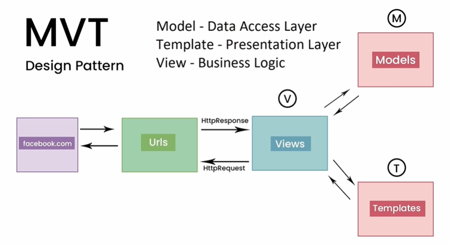
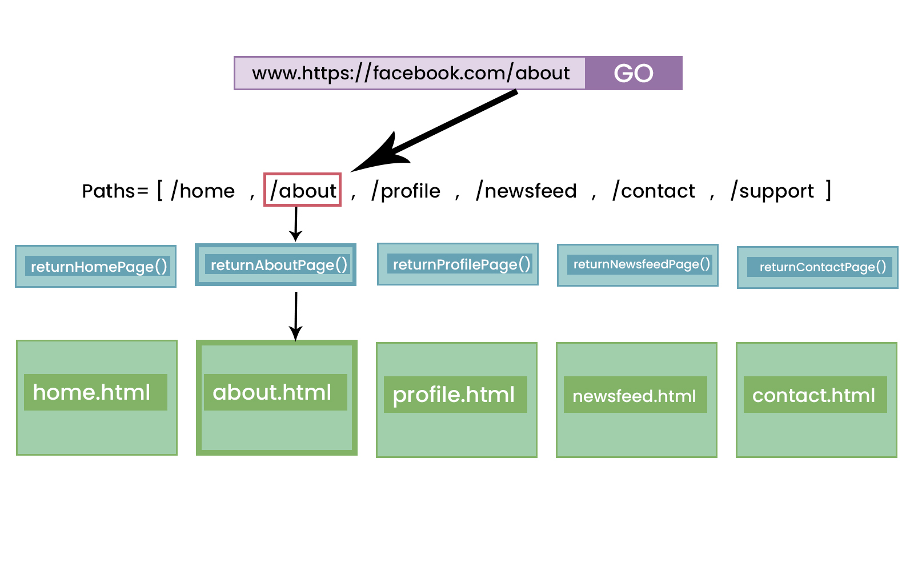

# Django_Lessons

## What is Django?

-   Django is a Python web framework
-   It is a backend framework (Server side framework)
-   It has packages and modules for the designs
-   It is a heavy weight framework (Bateries included) unlike light weight frameworks like Flask
-   It uses the MVT Design pattern (Model-View-Template)

## What is a Web Framework?

It is collection of modules, packages, and libraries designed to speed up web development

-   No need to start building code from scratch

## What can you build with Django?

-   Ecommerce websites
-   Social App
-   API for a mobile App
-   Etc

Building APIs with django is easy. It has the Django REST framework.

-   Rest framework help build Dajango rest APIs

## Other Python Frameworks

-   Flask (More light weight)
-   Cherry Pie
-   Web2py
-   Pyramid

## MVT Design Pattern

**Model** - Data Access Layer (How we model data with the data base). Data base tables built out with classes
**Templates** - Presentation Layer. This is what the user sees (Web page)
**View** - Business logic.
MVT design pattern is very similar to MVC

## Django Installation and Setup

-   Install python (From python.org)
-   Select part on a computer (folder) where you want to install
-   Install Django. First create a **virtual environment** and download Django into the virtual environment
-   Virtual environment is a way of creating different environments for all of our downloads and installs so that we do not have any conflicts with our projects
-   _pip list_ shows all the python packages available grobally or in a chosen virtual environment
-   Virtual environments helps in projects management (Being updated with the latest versions of django) keeping the projects which worked with the other versions. To avoid conflicts when installed globally

-   **To install virtual environment:** _pip install virtualenv_ Package for installing virtual environments

-   **To Create a Virtual Environment:** _virtualenv < virtual_environment_name >_
-   Start/activate the virtual environment (bash terminal): _source < virtual_environment_name >/scripts/activate_
-   To deactivate the virtual environment: _deactivate_
-   _pip list_ - shows all the list of packages installed in that environment

-   **To install Django** (pip install django) (while in the virtual environment)
-   **To check django list of command:** _django-admin_

### Some Django commands

-   _makemigrations_: Prepares the Database for for migrations
-   _migrate_: executes the above migrations (Takes the migrations created and executes them when we design our database) (Creates the database tables)
-   _runserver_: turns on the server
-   _startproject_: creates a django project
-   _startapp_: create apps

### Create the django project

-   After installing django, create the django project: django-admin startproject < project_name >
-   The above creates files for our django project

### Run the server

-   cd to the django project: _cd < project_name >_
-   Run the server: _python manage.py runserver_
-   Open url in the browser: http://127.0.0.1:8000/
-   To turn off server: _ctr c_

## Django Project Files

**Manage.py** file: Helps execute django commands. Do not touch/modify the file unless you know what exactly you are doing
**db.sqlite3** file: Sqlite database. Once we run the migrations, this is where our data will be stored until we change up our database e.g postgres
**venv** folder: Is our virtual environment
**devsearch** folder: Is our project folder.
**Inside devsearch**
**settings.py** file: This is the main project configuration for our entire django project. This is where we configure;

-   Any apps that we add (Installed_apps)
-   Our middleware (Middleware)
-   Our templates (Templates)
-   Our Databases (Databases)

**urls.py** file: This is our url navigation for our entire application. This is what determines what url users go to.
urlpatterns is a list. Takes care all the navigations for the site

**wsgi.py** file: Stands for web server gateway interface. We do not worry much about it.
**asgi.py** file: asynchronous server gateway interface. Another option. Django gives asynch support now

The two main files that we work with are; settings.py and urls.py

## Creating an App

The actual functionality of websites sits inside of app
In theory;
facebook.com folder: Is the configuration, our settings, our urls
The actual models templates urls and apis is going to be in the app e.g Groups App
- A project is made up of multiple apps

facebook.com is the project

-   Forexample anythng surrounding users eg user login, is created in its own app called Users App; Takes on DB Models for users,
    urls and templates

### Creating an App

We need atleast one app. Navigate to the projects folder

-   _python manage.py startapp <app_name>_
-   app_name folder is created with the following files
    **modes.py** file: This is where we create our database tables
    **views.py** file: This where the business logic will take place. The functions that will be triggered when the urls are activated
    **admin.py** file: Help us to configure our admin pannel
    **apps.py** file: The main apps configuration
-   Register the app that we created with our project in settings.py (installed*apps)
    e.g \_projects.apps.ProjectsConfig*
    projects - app folder
    apps.py - apps file
    ProjectsConfig - class

## Views and Urls

_urls.py_ file has a urls list and is in charge of the url routing system of our entire application.

paths - urlpatterns
If it doesn't find a pattern it throws an error
Once it finds a pattern, it triggers a  function e.g returnAboutPage() and displays an html data from that function

### Creating urls

-   You create a function and pass in http request as a parameter
-   The function should return data e.g html data or httpResponse
-   Create a path in the pathpatterns to trigger the function
-   Inside the pathpatterns, pass in; the path, function created and name of the path
-   When the function is triggered it returns data to the user

### How to pass in dynamic data into the projects (creating a dynamic route)

-   This is common when you visit a url and find in a dynamic data e.g id
-   On the path, use angle brackets, use a str value (variable type) for the id (3 options; str, int or slug).
-   After the variable type, put Colon, and variable name: str:pk. (pk - primary key)
-   Add the variable name in parameters for the path function

## Separating views (urls functions) from the urls file

This is helpful in bigger projects

-   The app e.g projects app should take care of any view(url) that deals with projects
-   This should be in the _views.py_ file. which stores all the views for a created app
-   Also, remove the routes (urls) associated with that app from the _root urls file_.
-   Create a new file in the created app, e.g projects app folder. Create the _urls.py_ file
-   import the path module from the django.urls module
-   Create a list of urls inside the urlpatterns list
-   import the views file and url functions inside the urls.py file
-   Connect the app urlpatterns for the app to the root url list file
-   inside the root urls.py file; import include from the django.urls module
-   Then use path("", include("projects.urls")) to include all projects app urls to the root
