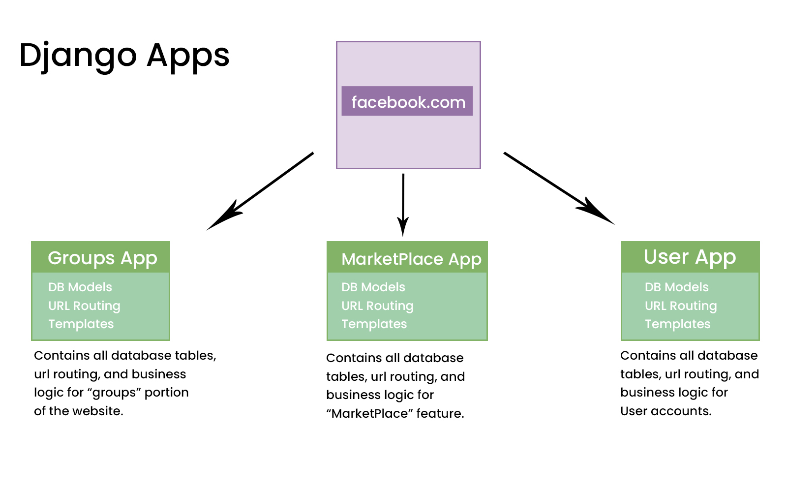

# Django_Lessons

## What is Django?

-   Django is a Python web framework
-   It is a backend framework (Server side framework)
-   It has packages and modules for the designs
-   It is a heavy weight framework (Bateries included) unlike light weight frameworks like Flask
-   It uses the MVT Design pattern (Model-View-Template)

## What is a Web Framework?

It is collection of modules, packages, and libraries designed to speed up web development

-   No need to start building code from scratch

## What can you build with Django?

-   Ecommerce websites
-   Social App
-   API for a mobile App
-   Etc

Building APIs with django is easy. It has the Django REST framework.

-   Rest framework help build Dajango rest APIs

## Other Python Frameworks

-   Flask (More light weight)
-   Cherry Pie
-   Web2py
-   Pyramid

## MVT Design Pattern

**Model** - Data Access Layer (How we model data with the data base). Data base tables built out with classes
**Templates** - Presentation Layer. This is what the user sees (Web page)
**View** - Business logic.
MVT design pattern is very similar to MVC

## Django Installation and Setup

-   Install python (From python.org)
-   Select part on a computer (folder) where you want to install
-   Install Django. First create a **virtual environment** and download Django into the virtual environment
-   Virtual environment is a way of creating different environments for all of our downloads and installs so that we do not have any conflicts with our projects
-   _pip list_ shows all the python packages available grobally or in a chosen virtual environment
-   Virtual environments helps in projects management (Being updated with the latest versions of django) keeping the projects which worked with the other versions. To avoid conflicts when installed globally

-   **To install virtual environment:** _pip install virtualenv_ Package for installing virtual environments

-   **To Create a Virtual Environment:** _virtualenv < virtual_environment_name >_
-   Start/activate the virtual environment (bash terminal): _source < virtual_environment_name >/scripts/activate_
-   To deactivate the virtual environment: _deactivate_
-   _pip list_ - shows all the list of packages installed in that environment

-   **To install Django** (pip install django) (while in the virtual environment)
-   **To check django list of command:** _django-admin_

### Some Django commands

-   _makemigrations_: Prepares the Database for for migrations
-   _migrate_: executes the above migrations (Takes the migrations created and executes them when we design our database) (Creates the database tables)
-   _runserver_: turns on the server
-   _startproject_: creates a django project
-   _startapp_: create apps

### Create the django project

-   After installing django, create the django project: django-admin startproject < project_name >
-   The above creates files for our django project

### Run the server

-   cd to the django project: _cd < project_name >_
-   Run the server: _python manage.py runserver_
-   Open url in the browser: http://127.0.0.1:8000/
-   To turn off server: _ctr c_

## Django Project Files

**Manage.py** file: Helps execute django commands. Do not touch/modify the file unless you know what exactly you are doing
**db.sqlite3** file: Sqlite database. Once we run the migrations, this is where our data will be stored until we change up our database e.g postgres
**venv** folder: Is our virtual environment
**devsearch** folder: Is our project folder.
**Inside devsearch**
**settings.py** file: This is the main project configuration for our entire django project. This is where we configure;

-   Any apps that we add (Installed_apps)
-   Our middleware (Middleware)
-   Our templates (Templates)
-   Our Databases (Databases)

**urls.py** file: This is our url navigation for our entire application. This is what determines what url users go to.
urlpatterns is a list. Takes care all the navigations for the site

**wsgi.py** file: Stands for web server gateway interface. We do not worry much about it.
**asgi.py** file: asynchronous server gateway interface. Another option. Django gives asynch support now

The two main files that we work with are; settings.py and urls.py

## Creating an App

The actual functionality of websites sits inside of app
In theory;
facebook.com folder: Is the configuration, our settings, our urls
The actual models templates urls and apis is going to be in the app e.g Groups App
- A project is made up of multiple apps

facebook.com is the project

-   Forexample anythng surrounding users eg user login, is created in its own app called Users App; Takes on DB Models for users,
    urls and templates

### Creating an App

We need atleast one app. Navigate to the projects folder

-   _python manage.py startapp <app_name>_
-   app_name folder is created with the following files
    **modes.py** file: This is where we create our database tables
    **views.py** file: This where the business logic will take place. The functions that will be triggered when the urls are activated
    **admin.py** file: Help us to configure our admin pannel
    **apps.py** file: The main apps configuration
-   Register the app that we created with our project in settings.py (installed*apps)
    e.g \_projects.apps.ProjectsConfig*
    projects - app folder
    apps.py - apps file
    ProjectsConfig - class

## Views and Urls

_urls.py_ file has a urls list and is in charge of the url routing system of our entire application.

paths - urlpatterns
If it doesn't find a pattern it throws an error
Once it finds a pattern, it triggers a  function e.g returnAboutPage() and displays an html data from that function

### Creating urls

-   You create a function and pass in http request as a parameter
-   The function should return data e.g html data or httpResponse
-   Create a path in the pathpatterns to trigger the function
-   Inside the pathpatterns, pass in; the path, function created and name of the path
-   When the function is triggered it returns data to the user

### How to pass in dynamic data into the projects (creating a dynamic route)

-   This is common when you visit a url and find in a dynamic data e.g id
-   On the path, use angle brackets, use a str value (variable type) for the id (3 options; str, int or slug).
-   After the variable type, put Colon, and variable name: str:pk. (pk - primary key)
-   Add the variable name in parameters for the path function

## Separating views (urls functions) from the urls file

This is helpful in bigger projects

-   The app e.g projects app should take care of any view(url) that deals with projects
-   This should be in the _views.py_ file. which stores all the views for a created app
-   Also, remove the routes (urls) associated with that app from the _root urls file_.
-   Create a new file in the created app, e.g projects app folder. Create the _urls.py_ file
-   import the path module from the django.urls module
-   Create a list of urls inside the urlpatterns list
-   import the views file and url functions inside the urls.py file
-   Connect the app urlpatterns for the app to the root url list file
-   inside the root urls.py file; import include from the django.urls module
-   Then use path("", include("projects.urls")) to include all projects app urls to the root

## Templates and Template Inheritance

-   Helps in rendering out an html page
-   Create a folder (in root directory) to store the templates and let django know where to find the
    templates and how to render them inside the views
-   Create html files for the different pages
-   Connect the html files (letting django to know where to find them) in settings file in the
    templates variables, in dirs. First import the os module to join the path with BASE_DIR e.g os.path.join(BASE_DIR, "templates")
-   Go to views.py file and use the render method e.g render(request, "projects.html")

### Connecting navbar template (constant for all pages)

-   Create the html page in the templates folder
-   Use include in other files to connect the page 
-   Use the include in the separate page e.g main.html
-   The main.html page should be inherited by other pages and the navbar will be on all the pages
    that inherit
-   __ includes another page inside another page. We take the navbar.html template and include it inside of another template. Read below for more explanation

### Extending a template

-   We build one main theme, style that theme and modify content depending on what's going on on each page
-   For example we can use main.html page to format all the pages.
-   Whatever you include in the main.html page e.g title, navbar you dont have to modify it in all the pages.
-   Any page that inherits from the main.html template will include the navbar, title and any styling
-   Use opening and closing block tags to specify where the child content should go.
    _ _
-   Once any page extends/inherits the main.html page e.g projects page, the content will stay inside the block tags

**To extend the page inside the child pages**

-   Child pages extending the parent page
    use 
-   Then tell where you what the child content to be with the _ _
-   The above helps us not to rewrite a bunch of content

### How to separate templates

-   Use the built in django way to work with apps
-   Separate according to apps for example anything to do with projects, will be projects app, users will be in users app
-   E.g inside the projects app (folder), create a folder called templates
-   Inside the templates folder, create another folder named your app name, e.g projects
-   Grab all the projects template related to that folder
-   In the root templates folder folder, leave only templates which are not specific to an app, that will be used in all apps

## Rendering Data to Templates

How django renders content;

**Variables**
{{ some_var }} - this is how we pass in variables into our template e.g how to access an object {{ my_dict.key }}

**Tags**
This is a way of adding python like logic to our project.

-   Writing if conditions, for-loops, else statements
    e.g
    Hello, {{ user.username }}.
    You have to close the tags

**Filters**
{{ django|title }}

# Building The Database

## Models and Admin Panel

db.sqlite3 file is connected to settings.py file
In the urls, the admin url cannot be accessed until we have the database ready
Django has the db tables prepared for us.

-   To apply the migrations (build the data base) run: _python manage.py migrate_
-   The above builds some tables in the database

### Admin Panel

To access the admin panel; http://127.0.0.1:8000/admin
The admin panel is simply a way to access the database

We need to first create a user to login
To create a user: _python manage.py createsuperuser_ then enter user details
superuser - creates a user with top level permission

Login into the admin panel with http://127.0.0.1:8000/admin to see all the tables we have in the database

By default, django creates Groups and Users tables.
You can add, delete and modify users

### Django Models

In Django we model our data using classes
In models.py file (inside the app e.g projects), we create classes that are going to represent tables e.g in the above picture, we see a class called Projects, with attribute of title, description and id.
When we create a class we inherit from models.Model which tells django that the class is officially a model not just a class.
We have to specify the different value types for the different table fields (attributes) e.g IntField, TextField, CharField etc.

**To Create Models**

-   Go to the app e.g projects
-   Go to models.py and create the class as above picture
-   To add the created models class onto tables, run _python manage.py makemigrations_ (Prep migrations). This creates a new file in migrations folder which includes our created fields
-   Now we to execute the migrations (add to the database) (each time we add a new field) _python manage.py migrate_
-   To see the created table, we need to register the model with the admin panel
-   Go to apps e.g projects, go to admin.py file
-   Import the model e.g from .models import Project
-   Register the model e.g admin.site.register(Project)
-   To change the default string in the database to a title create a method in models e.h
    def **str**(self):
    return self.title

## Database Relationships

-   You can use https://drawsql.app/ website to draw the database and list out all the tables that I want, show all the attributes in the tables and even connect the data that I can even visualize the database connections and the relationships e.g https://drawsql.app/teams/dennis-ivy/diagrams/dev-search
-   Relationships are a way of connecting database tables

### Types of relationships

1. One-to-one relationship: One table can be connected to another table and there can be only a one way relationship
   Example: If we had a user model (storing basic user details like emails, passwords, etc) and we want to extend this model, add in like a profile picture, a bio link, instead of modifying a user model, we could just create another table and call it user profile, and connect it via one-to-one relationship. Meaning one user can have one profile and one profile can have one user.

2. One-to-Many relationship (The most common): One table record can relate to many records in another table.
   Example: A user profile can have multiple projects. If you create an account on a website, you should be able to have multiple projects e.g an Ecommerce website, a Social Network etc. There can be many projects connected to one profile

3. Many-to-Many relationship: It means there is a two way relationship, e.g if we have some kind of tags e.g skills for a specific project e.g you created projects 1, 2, and 3 and these projects you have a tag for react, django and javascript. Project 1 and Project 2 can both have a tag of react. React can be connected to multiple projects while multiple projects can be connected to React or multiple tags.

**One-to-Many relationship**

-   A Project has multiple reviews
-   We will have a Projects table with attributes id, title and Description and a Reviews table with attributes id, and Body (actual review).
-   How we connect these tables is by automatically generating or manually creating another column for Parent_ID.
-   The above case, a parent is the Project. Once a review is created, you give it it's parent ID e.g project with ID 1 has two reviews
